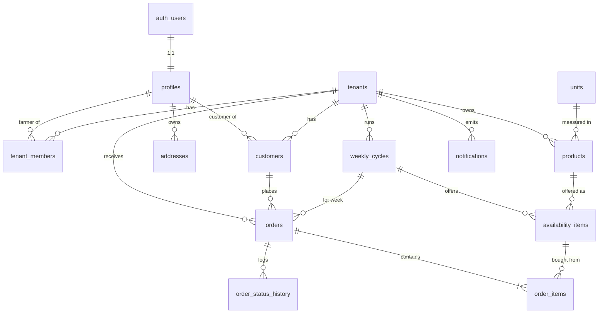

# Database Design

Status: **Phase 1 draft — awaiting product-owner review.** Implemented in Phase 2 as `supabase/migrations/*.sql`.
Related: [architecture.md](architecture.md) · [decisions.md](decisions.md)

---

## 1. Entity relationship diagram



Tenant view (as in spec §34 B):

```text
Tenant (farm)
  ├── tenant_members ──► profiles (farmers)
  ├── Products ──► units
  ├── Weekly cycles (week, deadline, status)
  │     └── Availability items (product, price, available, ordered)
  ├── Customers ──► profiles (people; addresses belong to the profile)
  └── Orders (snapshot of contact + delivery)
        ├── Order items (snapshot of name, unit, price)
        └── Order status history
```

### Why these deviations from the spec's model

| Spec                                                          | Here                                               | Reason                                                                                                                               |
| ------------------------------------------------------------- | -------------------------------------------------- | ------------------------------------------------------------------------------------------------------------------------------------ |
| `users` with `tenant_id`; `farmers`, `customers`              | `profiles` + `tenant_members` + `customers`        | One person can be a customer of several farms and a farmer of several farms without schema change (D-11).                            |
| `users.id` + `users.auth_user_id`                             | `profiles.id` **is** `auth.users.id`               | Supabase convention. One less join and policies read `id = auth.uid()`.                                                              |
| `weekly_availability` rows with `published`, `order_deadline` | `weekly_cycles` + `availability_items`             | Deadline and publish state belong to the week. "Copy last week" clones one cycle (D-12).                                             |
| `image_url`                                                   | `image_path` (Storage object path)                 | URLs are derived. Changing Storage host or CDN later needs no data migration.                                                        |
| addresses per tenant (D-16)                                   | addresses per **profile**, private to the customer | Supersedes D-16. The farmer sees the address snapshotted on each order, never the address book. One address book works across farms. |

## 2. Conventions

- Primary keys: `uuid default gen_random_uuid()`, except `units.code`.
- Every table: `created_at timestamptz not null default now()`. Mutable tables also have `updated_at`, maintained by the trigger `set_updated_at()`.
- Tenant-owned tables have `tenant_id uuid not null` and `unique (tenant_id, id)`, so children can use **composite FKs** `(tenant_id, x_id) → x(tenant_id, id)`.
- Money: `numeric(12,2)`. Quantities: `numeric(10,3)`. Text limits are enforced with `check (char_length(...) <= n)`.
- Enums are Postgres enum types; labels are translated in the UI.
- RLS enabled on **every** table in `public`. Helper functions live in schema `private`, which is not exposed through the API.
- `on delete`: `restrict` for business history (orders, products referenced by orders), `cascade` for pure children (items of a draft cycle, addresses of a deleted profile).

## 3. Enums

```sql
create type app_role        as enum ('CUSTOMER', 'FARMER', 'PLATFORM_ADMIN');
create type cycle_status    as enum ('DRAFT', 'PUBLISHED', 'CLOSED');
create type order_status    as enum ('PLACED', 'CONFIRMED', 'PREPARING', 'READY', 'DELIVERED', 'CANCELLED');
create type delivery_method as enum ('DELIVERY', 'PICKUP');
create type notification_status as enum ('PENDING', 'SENT', 'FAILED');
```

## 4. Tables

### 4.1 `tenants` — a farm

| Column                 | Type          | Constraints / default                                                    |
| ---------------------- | ------------- | ------------------------------------------------------------------------ |
| id                     | uuid          | PK                                                                       |
| name                   | text          | not null, 1–120 chars                                                    |
| slug                   | text          | not null, **unique**, `^[a-z0-9]+(-[a-z0-9]+)*$`, 3–50 chars             |
| description            | text          | ≤ 2000                                                                   |
| logo_path              | text          | Storage path                                                             |
| phone                  | text          | ≤ 30                                                                     |
| email                  | text          | ≤ 254                                                                    |
| address                | text          | ≤ 300                                                                    |
| delivery_information   | text          | ≤ 2000. Free text shown to customers ("We deliver Saturdays in Tirana…") |
| pickup_information     | text          | ≤ 1000. Where and when to pick up                                        |
| delivery_enabled       | boolean       | not null default true                                                    |
| pickup_enabled         | boolean       | not null default true; check `delivery_enabled or pickup_enabled`        |
| delivery_fee           | numeric(12,2) | not null default 0, ≥ 0                                                  |
| currency               | char(3)       | not null default `'ALL'`, `^[A-Z]{3}$`                                   |
| timezone               | text          | not null default `'Europe/Tirane'`                                       |
| enforce_inventory      | boolean       | not null default **true** (D-02)                                         |
| next_order_number      | integer       | not null default 1001 — **not updatable by `authenticated`**             |
| active                 | boolean       | not null default true — **only admin (service role) can change**         |
| created_at, updated_at | timestamptz   |                                                                          |

### 4.2 `profiles` — a person (1:1 with `auth.users`)

| Column                 | Type        | Constraints / default                                                                                                     |
| ---------------------- | ----------- | ------------------------------------------------------------------------------------------------------------------------- |
| id                     | uuid        | PK, FK → `auth.users(id)` on delete cascade                                                                               |
| role                   | app_role    | not null default `'CUSTOMER'` — **not updatable by `authenticated`**                                                      |
| first_name             | text        | not null, 1–80                                                                                                            |
| last_name              | text        | not null, 1–80                                                                                                            |
| phone                  | text        | ≤ 30                                                                                                                      |
| email                  | text        | not null — copy of `auth.users.email`, kept in sync by trigger, so farmers can contact customers without access to `auth` |
| preferred_locale       | text        | not null default `'sq'`, in (`sq`,`en`)                                                                                   |
| privacy_accepted_at    | timestamptz | set at sign-up from consent checkbox                                                                                      |
| created_at, updated_at |             |                                                                                                                           |

### 4.3 `tenant_members` — farmer ↔ farm

| Column     | Type        | Constraints                                        |
| ---------- | ----------- | -------------------------------------------------- |
| tenant_id  | uuid        | FK → tenants on delete cascade                     |
| profile_id | uuid        | FK → profiles on delete cascade                    |
| created_at | timestamptz |                                                    |
|            |             | **PK (tenant_id, profile_id)**; index (profile_id) |

### 4.4 `customers` — person ↔ farm (the farm's customer record)

| Column                 | Type    | Constraints                                                                    |
| ---------------------- | ------- | ------------------------------------------------------------------------------ |
| id                     | uuid    | PK                                                                             |
| tenant_id              | uuid    | FK → tenants, not null                                                         |
| profile_id             | uuid    | FK → profiles on delete cascade, not null                                      |
| active                 | boolean | not null default true. Farmer can block ordering.                              |
| created_at, updated_at |         |                                                                                |
|                        |         | **unique (tenant_id, profile_id)**, unique (tenant_id, id); index (profile_id) |

### 4.4b `customer_notes` — farmer's private notes (D-71)

`tenant_id, customer_id (PK, FK composite → customers, cascade), notes ≤ 2000, updated_at`. Members of the tenant only; the customer cannot read it. (Replaces the former `customers.farmer_notes` column.)

### 4.5 `addresses` — customer's address book (profile-owned, private)

| Column                 | Type    | Constraints                                      |
| ---------------------- | ------- | ------------------------------------------------ |
| id                     | uuid    | PK                                               |
| profile_id             | uuid    | FK → profiles on delete cascade, not null        |
| label                  | text    | ≤ 50 ("Home", "Work")                            |
| address_line           | text    | not null, 1–300                                  |
| city                   | text    | not null, 1–100                                  |
| notes                  | text    | ≤ 500 (floor, landmark)                          |
| is_default             | boolean | not null default false                           |
| created_at, updated_at |         |                                                  |
|                        |         | partial **unique (profile_id) where is_default** |

### 4.6 `units` — global reference data

| Column       | Type          | Constraints                                                   |
| ------------ | ------------- | ------------------------------------------------------------- |
| code         | text          | PK (`kg`, `g`, `piece`, `l`, `box`, `dozen`)                  |
| default_step | numeric(10,3) | not null, > 0 (kg 0.5, g 100, piece 1, l 0.5, box 1, dozen 1) |
| sort_order   | smallint      | not null                                                      |

Labels come from `messages/*.json` (`Units.kg` → "kg"; `Units.piece` → "copë" / "pcs"). Adding a unit needs a migration plus two translation keys, and no code changes.

### 4.7 `products` — the farm's catalogue

| Column                 | Type          | Constraints                                                                                        |
| ---------------------- | ------------- | -------------------------------------------------------------------------------------------------- |
| id                     | uuid          | PK                                                                                                 |
| tenant_id              | uuid          | FK → tenants, not null                                                                             |
| name                   | text          | not null, 1–120                                                                                    |
| description            | text          | ≤ 1000                                                                                             |
| category               | text          | ≤ 50 (free text, e.g. "Perime", "Fruta", "Bulmet")                                                 |
| unit_code              | text          | FK → units, not null                                                                               |
| quantity_step          | numeric(10,3) | not null, > 0 — the increment for the [-]/[+] buttons (prefilled from unit)                        |
| image_path             | text          | Storage path in `product-images`                                                                   |
| active                 | boolean       | not null default true (archived products disappear from new weeks)                                 |
| sort_order             | integer       | not null default 0                                                                                 |
| created_at, updated_at |               |                                                                                                    |
|                        |               | unique (tenant_id, id); **unique (tenant_id, lower(name))**; index (tenant_id, active, sort_order) |

### 4.8 `weekly_cycles` — one ordering week of a farm

| Column                 | Type         | Constraints                                                                                                                                              |
| ---------------------- | ------------ | -------------------------------------------------------------------------------------------------------------------------------------------------------- |
| id                     | uuid         | PK                                                                                                                                                       |
| tenant_id              | uuid         | FK → tenants, not null                                                                                                                                   |
| week_start             | date         | not null, **must be a Monday** (`extract(isodow from week_start) = 1`)                                                                                   |
| week_end               | date         | **generated always as (week_start + 6) stored**                                                                                                          |
| order_deadline         | timestamptz  | not null                                                                                                                                                 |
| status                 | cycle_status | not null default `'DRAFT'`                                                                                                                               |
| message                | text         | ≤ 500, shown to customers ("Delivery on Saturday morning")                                                                                               |
| published_at           | timestamptz  |                                                                                                                                                          |
| closed_at              | timestamptz  |                                                                                                                                                          |
| created_at, updated_at |              |                                                                                                                                                          |
|                        |              | unique (tenant_id, id); **unique (tenant_id, week_start)**; **partial unique (tenant_id) where status = 'PUBLISHED'**, so at most one open week per farm |

Ordering is open when `status = 'PUBLISHED' and now() < order_deadline`. When the deadline passes the week behaves as closed, so no cron job is needed. `CLOSED` is set explicitly by the farmer, or automatically when the next week is published.

### 4.9 `availability_items` — a product offered in a week (price and stock)

| Column                 | Type          | Constraints                                                                             |
| ---------------------- | ------------- | --------------------------------------------------------------------------------------- |
| id                     | uuid          | PK                                                                                      |
| tenant_id              | uuid          | not null                                                                                |
| cycle_id               | uuid          | not null, **FK (tenant_id, cycle_id) → weekly_cycles(tenant_id, id)** on delete cascade |
| product_id             | uuid          | not null, **FK (tenant_id, product_id) → products(tenant_id, id)** on delete restrict   |
| price                  | numeric(12,2) | not null, ≥ 0                                                                           |
| available_quantity     | numeric(10,3) | not null, ≥ 0                                                                           |
| ordered_quantity       | numeric(10,3) | not null default 0, ≥ 0 — **only changed by DB functions**                              |
| minimum_quantity       | numeric(10,3) | null or > 0                                                                             |
| maximum_quantity       | numeric(10,3) | null or > 0; check `minimum_quantity <= maximum_quantity`                               |
| listed                 | boolean       | not null default true (spec's per-product "✓ Published" toggle)                         |
| sort_order             | integer       | not null default 0                                                                      |
| created_at, updated_at |               |                                                                                         |
|                        |               | unique (tenant_id, id); **unique (cycle_id, product_id)**; index (product_id)           |

A trigger blocks lowering `available_quantity` below `ordered_quantity` when the tenant has `enforce_inventory` enabled.

### 4.10 `orders`

| Column                 | Type            | Constraints                                                                                      |
| ---------------------- | --------------- | ------------------------------------------------------------------------------------------------ |
| id                     | uuid            | PK                                                                                               |
| tenant_id              | uuid            | not null                                                                                         |
| cycle_id               | uuid            | not null, FK (tenant_id, cycle_id) → weekly_cycles on delete restrict                            |
| customer_id            | uuid            | not null, FK (tenant_id, customer_id) → customers on delete restrict                             |
| order_number           | integer         | not null; **unique (tenant_id, order_number)**                                                   |
| status                 | order_status    | not null default `'PLACED'`                                                                      |
| delivery_method        | delivery_method | not null                                                                                         |
| subtotal               | numeric(12,2)   | not null, ≥ 0                                                                                    |
| delivery_fee           | numeric(12,2)   | not null, ≥ 0 (snapshot; 0 for pickup)                                                           |
| total                  | numeric(12,2)   | not null; check `total = subtotal + delivery_fee`                                                |
| currency               | char(3)         | not null (snapshot)                                                                              |
| customer_name          | text            | not null (snapshot)                                                                              |
| customer_phone         | text            | not null (snapshot)                                                                              |
| customer_email         | text            | not null (snapshot)                                                                              |
| delivery_address       | text            | snapshot; check `delivery_method = 'PICKUP' or delivery_address is not null`                     |
| delivery_city          | text            | snapshot                                                                                         |
| delivery_notes         | text            | ≤ 500                                                                                            |
| notes                  | text            | ≤ 1000, customer's note to the farmer                                                            |
| idempotency_key        | uuid            | not null; **unique (customer_id, idempotency_key)**, so a double tap creates one order           |
| placed_at              | timestamptz     | not null default now()                                                                           |
| status_changed_at      | timestamptz     | not null default now()                                                                           |
| created_at, updated_at |                 |                                                                                                  |
|                        |                 | unique (tenant_id, id); index (tenant_id, cycle_id, status); index (customer_id, placed_at desc) |

### 4.11 `order_items`

| Column                | Type          | Constraints                                                                            |
| --------------------- | ------------- | -------------------------------------------------------------------------------------- |
| id                    | uuid          | PK                                                                                     |
| tenant_id             | uuid          | not null                                                                               |
| order_id              | uuid          | not null, FK (tenant_id, order_id) → orders on delete cascade                          |
| availability_item_id  | uuid          | not null, FK (tenant_id, availability_item_id) → availability_items on delete restrict |
| product_id            | uuid          | not null, FK (tenant_id, product_id) → products on delete restrict                     |
| product_name_snapshot | text          | not null                                                                               |
| unit_snapshot         | text          | not null (unit code)                                                                   |
| quantity              | numeric(10,3) | not null, > 0                                                                          |
| unit_price            | numeric(12,2) | not null, ≥ 0 (price actually paid)                                                    |
| total_price           | numeric(12,2) | not null; check `total_price = round(quantity * unit_price, 2)`                        |
|                       |               | **unique (order_id, availability_item_id)**; index (tenant_id, product_id)             |

### 4.12 `order_status_history` — audit trail

`id, tenant_id, order_id (FK composite, cascade), from_status order_status null, to_status order_status not null, changed_by uuid → profiles null, note text ≤ 500, created_at`. Index (order_id, created_at).
Written only by `place_order()` and `set_order_status()`.

### 4.13 `notifications` — outbox (Phase 6)

`id, tenant_id, event text, channel text default 'email', recipient text, locale text, payload jsonb, status notification_status default 'PENDING', attempts smallint default 0, last_error text, next_attempt_at timestamptz default now(), sent_at, created_at`. Index (status, next_attempt_at).
`payload` is jsonb because it is a message envelope, not business data. No access for `authenticated`; only the service role reads and updates it.

## 5. Views

`farmer_cycle_product_totals` (`security_invoker = true`, so the caller's RLS applies):

```sql
select oi.tenant_id, o.cycle_id, oi.product_id,
       min(oi.product_name_snapshot) as product_name,
       min(oi.unit_snapshot)         as unit_code,
       sum(oi.quantity)              as total_quantity,
       count(distinct o.id)          as order_count,
       sum(oi.total_price)           as total_amount
from order_items oi
join orders o on o.id = oi.order_id
where o.status <> 'CANCELLED'
group by oi.tenant_id, o.cycle_id, oi.product_id;
```

It answers "How much do I need to prepare?" A customer querying it sees only totals of their own orders, so nothing leaks.

## 6. Functions (all `set search_path = ''`)

### RLS helpers (`private` schema, `security definer`, `stable`)

| Function                             | Returns true when                                                  |
| ------------------------------------ | ------------------------------------------------------------------ |
| `private.is_platform_admin()`        | `profiles.role = 'PLATFORM_ADMIN'` for `auth.uid()`                |
| `private.is_tenant_member(tid uuid)` | a `tenant_members` row exists for (tid, `auth.uid()`)              |
| `private.my_customer_ids()`          | returns `setof uuid`: customer ids whose `profile_id = auth.uid()` |
| `private.is_my_customer_record(cid)` | `cid` belongs to `auth.uid()`                                      |

They are SECURITY DEFINER so policies don't recurse through RLS of the tables they read.

### Business functions (`public`, callable via `supabase.rpc`, `security definer`, each re-checks the caller)

| Function                                                                                                                                                                                                                                          | Purpose                                                                                                                                                                                                                                                                                                                                                                                                                                                                                                                                                                                                                                                                                                                                                                                                                                                                                                                                               |
| ------------------------------------------------------------------------------------------------------------------------------------------------------------------------------------------------------------------------------------------------- | ----------------------------------------------------------------------------------------------------------------------------------------------------------------------------------------------------------------------------------------------------------------------------------------------------------------------------------------------------------------------------------------------------------------------------------------------------------------------------------------------------------------------------------------------------------------------------------------------------------------------------------------------------------------------------------------------------------------------------------------------------------------------------------------------------------------------------------------------------------------------------------------------------------------------------------------------------- |
| `place_order(p_tenant_slug text, p_cycle_id uuid, p_items jsonb, p_delivery_method delivery_method, p_address_id uuid, p_phone text, p_delivery_notes text, p_notes text, p_idempotency_key uuid) returns table(order_id uuid, order_number int)` | The **only** way to create orders. Requires `auth.uid()`. Resolves the active tenant by slug. Finds or creates the caller's `customers` row (must be `active`). Locks the cycle (`for share`) and requires PUBLISHED and `now() < order_deadline`. Locks the requested availability items `for update` in id order (avoids deadlocks). Validates for each item: belongs to cycle, `listed`, product `active`, quantity > 0 and a multiple of `quantity_step`, min/max, and stock when `enforce_inventory`. Checks the delivery method is enabled and the address belongs to the caller. Snapshots name, unit and price, computes totals and the delivery fee, increments `ordered_quantity`, takes `next_order_number`, inserts the order, items, history row and notification rows. Returns the existing order if the idempotency key was already used. Raises coded errors (`CYCLE_CLOSED`, `INSUFFICIENT_STOCK:<item>`, …) that the UI translates. |
| `set_order_status(p_order_id uuid, p_status order_status, p_note text)`                                                                                                                                                                           | Caller must be a member of the order's tenant. Allowed: any forward move along `PLACED → CONFIRMED → PREPARING → READY → DELIVERED` (skipping steps allowed), or `→ CANCELLED` from any non-final state. `DELIVERED` and `CANCELLED` are final. Cancelling releases `ordered_quantity`. Writes history and a notification row.                                                                                                                                                                                                                                                                                                                                                                                                                                                                                                                                                                                                                        |
| `publish_cycle(p_cycle_id uuid)`                                                                                                                                                                                                                  | Member only. Requires a future deadline and at least one listed item. Sets any other PUBLISHED cycle of the tenant to CLOSED, then publishes this one.                                                                                                                                                                                                                                                                                                                                                                                                                                                                                                                                                                                                                                                                                                                                                                                                |
| `close_cycle(p_cycle_id uuid)`                                                                                                                                                                                                                    | Member only. PUBLISHED → CLOSED (stops new orders early). A DRAFT can be deleted instead, but only while it has no orders.                                                                                                                                                                                                                                                                                                                                                                                                                                                                                                                                                                                                                                                                                                                                                                                                                            |
| `copy_cycle(p_source_cycle_id uuid, p_week_start date) returns uuid`                                                                                                                                                                              | Member only. Creates a DRAFT cycle for `p_week_start` with the same deadline weekday and time (in the tenant timezone), copying price, quantities, min/max, listed and sort order for **active** products. `ordered_quantity` starts at 0.                                                                                                                                                                                                                                                                                                                                                                                                                                                                                                                                                                                                                                                                                                            |

### Triggers

| Trigger                                  | Purpose                                                                                                                                                                      |
| ---------------------------------------- | ---------------------------------------------------------------------------------------------------------------------------------------------------------------------------- |
| `on_auth_user_created` (on `auth.users`) | Inserts `profiles` (role always CUSTOMER) from `raw_user_meta_data` (names, phone, locale, consent). If metadata has `tenant_slug` of an active tenant, inserts `customers`. |
| `on_auth_user_email_updated`             | Syncs `profiles.email`.                                                                                                                                                      |
| `set_updated_at` (all mutable tables)    | Maintains `updated_at`.                                                                                                                                                      |
| `availability_items_guard`               | Rejects `available_quantity < ordered_quantity` when inventory is enforced. (Direct writes to `ordered_quantity` are already blocked by column grants.)                      |

## 7. Row Level Security

All policies target the roles `anon` and/or `authenticated` and use `(select auth.uid())`. `service_role` bypasses RLS and is used only server-side for admin and notification work.

| Table                | SELECT                                                                    | INSERT                       | UPDATE                                                               | DELETE                                 |
| -------------------- | ------------------------------------------------------------------------- | ---------------------------- | -------------------------------------------------------------------- | -------------------------------------- |
| tenants              | anon+auth: `active`; member; admin                                        | — (service role)             | member (column grant excludes `active`, `slug`, `next_order_number`) | —                                      |
| profiles             | self; farmer of a tenant where the profile is a customer; admin           | — (trigger)                  | self (columns: names, phone, preferred_locale)                       | —                                      |
| tenant_members       | own rows; admin                                                           | —                            | —                                                                    | —                                      |
| customers            | own (`profile_id = uid`); member; admin                                   | — (trigger / `place_order`)  | member (column: `active`)                                            | —                                      |
| addresses            | self                                                                      | self                         | self                                                                 | self                                   |
| units                | anon+auth: all                                                            | —                            | —                                                                    | —                                      |
| products             | anon+auth: `active` and tenant active; member (incl. archived); admin     | member                       | member                                                               | member, if never offered (FK restrict) |
| weekly_cycles        | anon+auth: status in (PUBLISHED, CLOSED) and tenant active; member; admin | member, status must be DRAFT | member, not `status` (status changes only via functions)             | member, DRAFT only                     |
| availability_items   | anon+auth: `listed` and cycle PUBLISHED/CLOSED; member; admin             | member, cycle not CLOSED     | member, cycle not CLOSED (column grant excludes `ordered_quantity`)  | member, if never ordered               |
| orders               | customer: `customer_id in my_customer_ids()`; member; admin               | — (`place_order` only)       | — (`set_order_status` only)                                          | —                                      |
| order_items          | customer via own order; member; admin                                     | —                            | —                                                                    | —                                      |
| order_status_history | customer via own order; member; admin                                     | —                            | —                                                                    | —                                      |
| notifications        | —                                                                         | —                            | —                                                                    | —                                      |

"member" = `private.is_tenant_member(tenant_id)`; "admin" = `private.is_platform_admin()`.

**Column-level grants:** `revoke update on <table> from authenticated`, then `grant update (<allowed columns>) on <table> to authenticated`. RLS decides _which rows_; grants decide _which columns_. This keeps a farmer from changing `next_order_number` or `ordered_quantity`, and a customer from changing `profiles.role`, even through the raw REST API.

**Storage** (`product-images` bucket, public read): objects are stored at `{tenant_id}/{uuid}.{ext}`. Insert, update and delete require `private.is_tenant_member((storage.foldername(name))[1]::uuid)`. Size limit 5 MB; MIME types jpeg, png and webp only.

## 8. Required isolation tests (pgTAP, `supabase/tests/`)

Run with `npm run db:test` against seeded farms A and B:

1. Farmer A selects products, weekly cycles, availability items, orders, order items, customers → only farm A rows. Selecting farm B rows by id returns 0 rows.
2. Farmer A updates or deletes farm B's product or availability item → 0 rows affected. Inserting a product with `tenant_id = B` → RLS violation.
3. Farmer A calls `set_order_status` on a farm B order → error. Calling `publish_cycle` on farm B's cycle → error.
4. Customer A selects orders and order items → only own orders. Customer B's order by id → 0 rows.
5. Customer cannot `insert`/`update` `orders` or `order_items` directly, and cannot update `profiles.role`.
6. Anonymous user sees PUBLISHED-cycle items, but no DRAFT cycles or items, no orders, no customers, no profiles.
7. `place_order`: rejects closed or expired cycle, unlisted item, item from another cycle or tenant, quantity over stock (when enforced), quantity not matching step, min/max violations; preserves the snapshot price after the farmer changes the price; is idempotent per key.
8. Composite FKs: an availability item cannot reference a product of another tenant, even as service role.

## 9. Seed data (`supabase/seed.sql`, local and staging only)

- **Farm A:** "Ferma Kodra e Gjelbër" (`ferma-kodra`), Tirana, ALL, delivery fee 200.
  - 14 products: domate, kastravec, sallatë jeshile, speca, patate, qepë, karota, mollë, dardha, vezë fshati (dozen), djathë i bardhë (kg), gjizë, mjaltë (jar → piece), vaj ulliri (l).
- **Farm B:** "Ferma Fusha" (`ferma-fusha`). A few products and an order, used only by isolation tests.
- **Users** (password `Password123` locally):
  - `admin@example.com` (PLATFORM_ADMIN)
  - `farmer.a@example.com`, `farmer.b@example.com`
  - customers `ana@`, `bledi@`, `drita@`, `erion@`, `fatjona@example.com`
- **Weeks:**
  - last week: CLOSED, with ~8 orders in mixed statuses at slightly different prices (shows historical prices)
  - this week: PUBLISHED, deadline in the future, ~5 orders
- Seed users are created through `auth.users` inserts in seed.sql (local only). Production never runs the seed.
